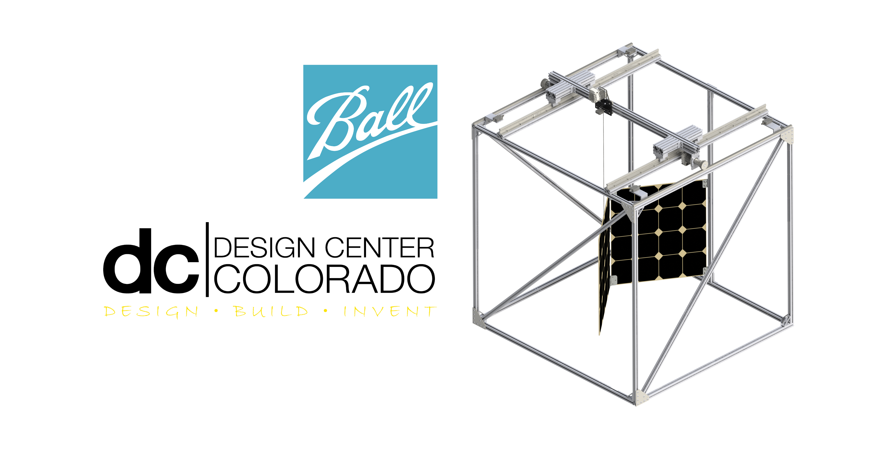
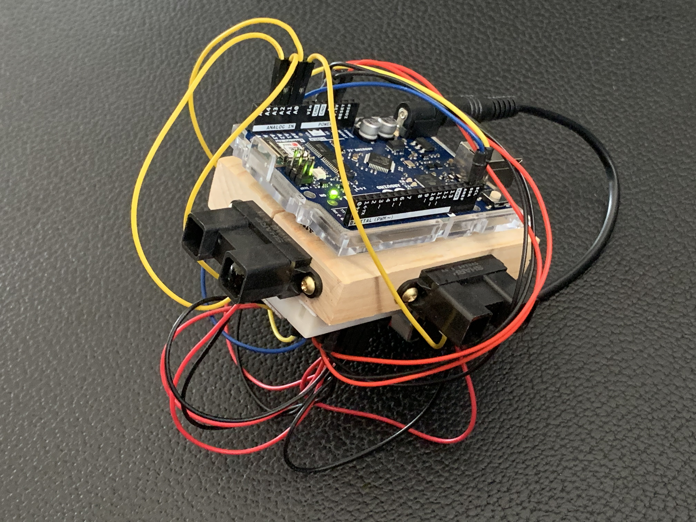
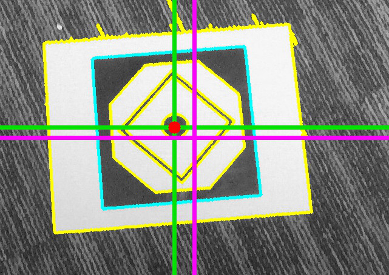
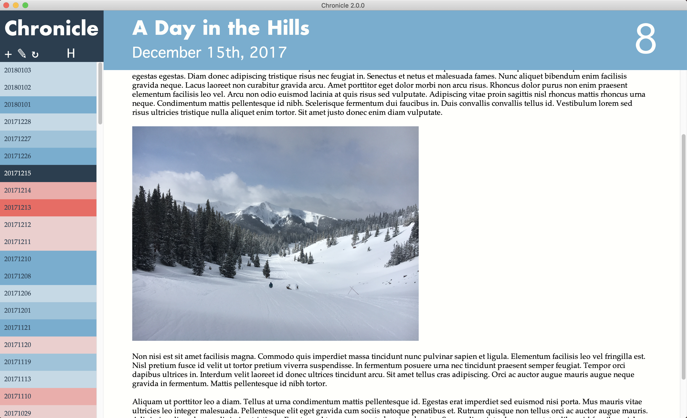
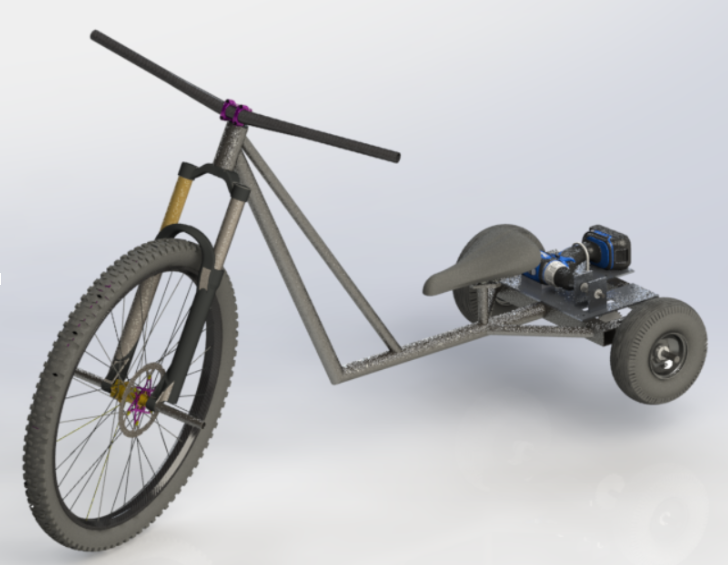
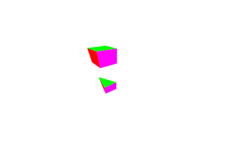
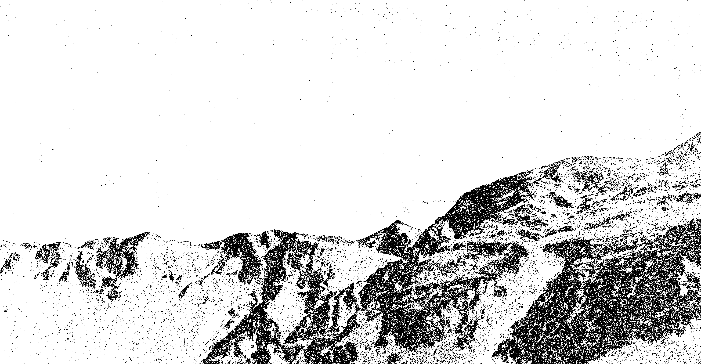
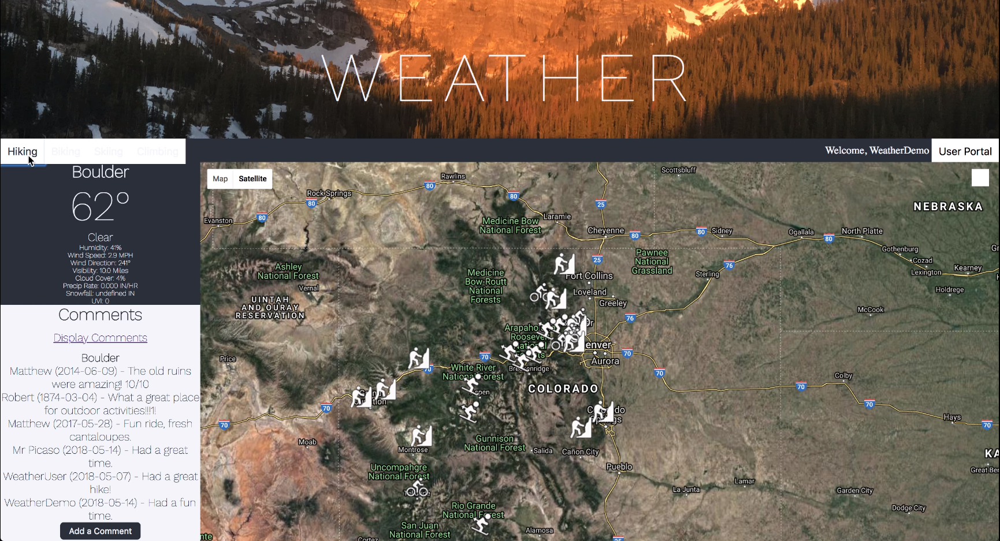

  Jarrett <b>Philips</b> 

 <a href = "mailto: jarrettphilips@gmail.com">jarrettphilips@gmail.com</a> | 303-817-8521 | <a href="https://github.com/jarrettphilips">Github</a> | <a href="https://linkedin.com/in/jarrettphilips">LinkedIn</a> 

## Table of Contents
1. [Project Marion - Gravity Offload System](#Project-Marion---Gravity-Offload-System)
2. [Independent Proximity Sensor](#independent-proximity-sensor)
3. [Self Landing Drone](#self-landing-drone)
4. [Journaling Application](#journaling-application)
5. [Drill Powered Bike](#drill-powered-bike)
6. [Basic 3D Graphics Engine](#basic-3d-graphics-engine)
7. [Edge Detection](#edge-detection)
8. [Weather Website](#weather-website)

_________________
## Project Marion - Gravity Offload System
###### 2020 | Mechanical Design, Computer Vision, ROS, Networking, System Administration
 

In order to ensure reliability in orbit, solar arrays must first be precisely tested on the ground. This requires the offload of gravitational forces while minimizing any forces imposed by the testing fixture itself. As our senior project at CU Boulder's Design Center Colorado, we partnered with Ball Aerospace to develop a new test fixture. This project is a solution that provides an active, scalable, and reconfigurable apparatus to support ground testing for a wide range of solar array sizes and variable deployment architectures. The prototype implements a computer vision control system to autonomously track the path of each individual solar panel in the array. The active, two-axis gantry system positions itself over the attachment point suspending each solar panel, minimizing lateral forces during testing. I was the systems engineer and lead software engineer, responsible for the planning and creation of a vast majority of the codebase, including the Robotic OperatingSystem (ROS) framework, computer vision systems (Python), reactive and predictive motion path generation (Python), motor drivers (C++), as well as system administration and networking. Its source code remains Ball's IP, but our white paper is available for everyone to read!

**White Paper** https://drive.google.com/file/d/1Ck5W8u5mIM23X1tua7kFaKKlf4Jps6Nt/view

_________________
## Independent Proximity Sensor
###### 2020 | Electrical Design, Orientation, Networking
 

A custom built sensor used to generate point clouds of an environment. The handheld sensor has numerous infrared distance sensors mounted. Tracking orientation enables the user to roll and move the sensor with their hand to scan the environment while maintaining accurate data measurements. This freedom of motion also allows a motor-less design, instead relying on intelligent software to track the infrared sensors orientation through an IMU chip and map the data accordingly. Once the sensor data is gathered, it is then be transmitted (Arduino / C++) to an external computer which stores and renders the produced point cloud in real time (Python). A more in-depth report is also available for more detail on the mathematics.

**Report** https://drive.google.com/file/d/1Ck5W8u5mIM23X1tua7kFaKKlf4Jps6Nt/view \
**Source** https://github.com/JarrettPhilips/independent_proximity_sensor

_________________
## Self Landing Drone
###### 2018 | Computer Vision, ROS
 

 A quadcopter program that can identify, locate, approach, and land on a moving platform of unknown trajectory. A robot (Arduino / C++) is used to move the landing pad in a randomized path. The system is coordinated through ROS running on a central computer. I was responsible for the computer vision code (Python) that locates the pad within the camera's feed and determines its relative position (in meters) to the drone.

**Source** https://github.com/JarrettPhilips/self_landing_drone

_________________
## Journaling Application
###### 2018 | Desktop Application Development
 

Built from scratch using Java Swing, this application allows reading and writing of journal entries stored in a universal format for easy manipulation in or out of the program. It supports photos and a ranking system which alters the color of the presented entry.

**Source** https://github.com/JarrettPhilips/chronicle

_________________
## Drill Powered Bike
###### 2019 | Mechanical Design, CAD, Manufacturing
 

A custom built bicycle driven by a drill made to complete a hill course. The process included design, CAD work, drawing creation, and manufacturing. I was responsible for systems integration and most manufacturing, including various machining tasks and welding.

 
 
 
 
 
 
 
 
 

_________________
## BASIC 3D GRAPHICS ENGINE
###### 2016 | Graphics, Linear Algebra
 

A basic rendering engine created from scratch in Java. It implements basic 3D objects from data files provided to it. It uses only a library to draw polygons, so all translational, camera, and rendering calculations are custom made. It features clipping, rotation, object, and camera movement. A small UI allows the user to switch between perspective and parallel rendering.

 
 
 
 

**Source** https://github.com/JarrettPhilips/basic_3D_graphics_engine

 
 
 
 

_________________
## Edge Detection
###### 2015 | FILE IO, IMAGE PROCESSING
 

Run from the command line, this C++ application takes a photo as an input, and generates a new image, marking all of the edges identified.

**Documentation** https://drive.google.com/file/d/15ym5iCb1jf6QW5X3XaaPPOwPUeZ-vpXg/view \
**Source** https://github.com/JarrettPhilips/edge_detection

_________________
## Weather Website
###### 2020 | Full Stack Development
 

Snow Much Fun is a social weather site, where data from all over Colorado is collected and displayed at popular outdoor locations. Users can view and comment on different locations to share more detailed updates on conditions, crowds, activities and more. I was responsible for the HTML/CSS front end, SQL database, and PHP user / password login system.

**Demo** https://www.youtube.com/watch?v=82GGwOVgvDo \
**Source** https://github.com/JarrettPhilips/snowmuchfun_website
